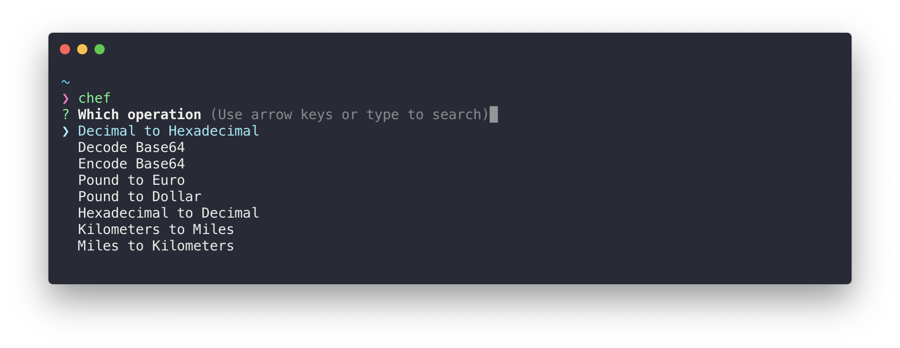

<h1 align="center">chef-cli</h1>
<p align="center">Quickly <i>convert</i> <i><strong>things</strong> into other <strong>things</strong></i></p>
<p align="center">
  <a href="https://travis-ci.org/cesarferreira/chef-cli"></a>
  <a href="https://www.npmjs.com/package/chef-for-terminal"></a>
  <a href="https://www.npmjs.com/package/chef-for-terminal"></a>
  <a href="https://github.com/cesarferreira/oh/blob/master/LICENSE"></a>
</p>

<p align="center">
  
</p>

## Install

```sh
npm install -g chef-for-terminal
```

## Usage
Run the command and convert away

```
Usage
   $ chef
```

### Create your own recipes:

Clone the repo:
```bash
git clone https://github.com/cesarferreira/chef-cli
cd chef-cli
npm link
```
```js
$ chef create "Kilometers to Miles"
```

A file `kilometers-to-miles.js` is created inside `recipes/` folder with:

```js
module.exports = {
    title: "Kilometers to Miles",
    execute: input => {
        return new Promise((resolve, reject) => {
            // TODO calculations with 'input'
            resolve(42);
        });
    }
}
```

All you have to do is replace the `execute` function with your own and open a pull request!

<p align="center">
  
</p>

----------

Made with ❤️ by [Cesar Ferreira](https://cesarferreira.com)

